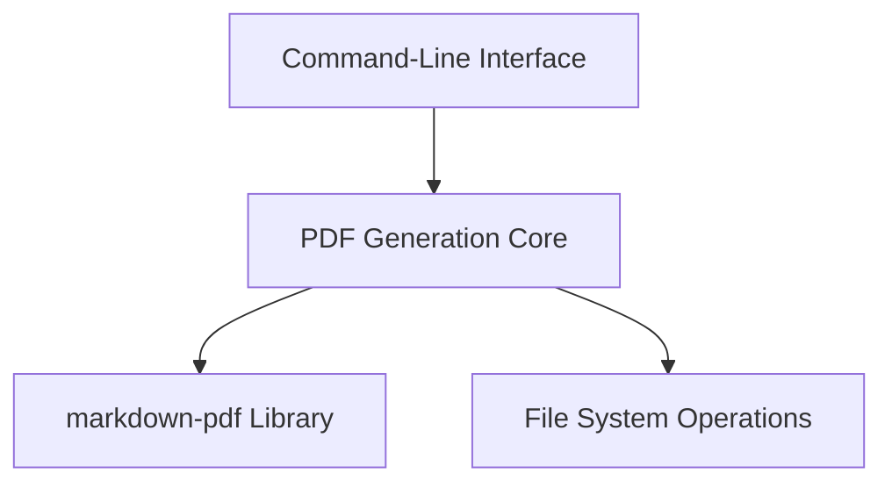

# Design Document

## Overview

Kiro2PDF is a command-line utility that converts Kiro specification markdown files into a consolidated PDF document. The tool is designed to be simple to use while providing customization options for the output. It leverages the `markdown-pdf` library to handle the conversion process and adds features like automatic table of contents generation and custom styling.

## Architecture

The architecture of Kiro2PDF is straightforward, following a command-line application pattern:

1. **Command-Line Interface**: Handles user input through command-line arguments
2. **PDF Generation Core**: Processes markdown files and generates the PDF
3. **External Library Integration**: Leverages the `markdown-pdf` library for the actual conversion

## Components and Interfaces

### Command-Line Interface

The command-line interface is implemented using Python's `argparse` library. It defines the following parameters:

- `input_files`: One or more paths to input Markdown files (required, positional arguments)
- `-o, --output`: The path for the output PDF file (required)
- `-t, --toc-level`: Maximum heading level to include in the Table of Contents (optional, default=6)
- `-z, --optimize`: Flag to optimize the PDF file size (optional)
- `-c, --css`: Path to a CSS file for custom styling (optional)

### PDF Generation Core

The core functionality is implemented in the `create_pdf_from_markdown_files` function, which:

1. Initializes a `MarkdownPdf` object with the specified TOC level and optimization settings
2. Processes each input markdown file:
   - Reads the file content
   - Extracts the filename to use as a section title
   - Prepends a top-level heading to ensure proper TOC entry
   - Adds the content as a section to the PDF
3. Sets PDF metadata
4. Saves the PDF to the specified output location

### External Library Integration

The tool relies on the `markdown-pdf` library, specifically using:

- `MarkdownPdf`: Main class for PDF generation
- `Section`: Class representing a section in the PDF

## Data Models

### Input Data

- **Markdown Files**: Text files with markdown formatting
- **CSS File** (optional): Text file with CSS styling rules

### Output Data

- **PDF Document**: A structured PDF with:
  - Table of Contents
  - Sections for each input file
  - Metadata (title, author)

## Error Handling

The application implements the following error handling strategies:

1. **File Not Found**: If an input markdown file or CSS file is not found, the application displays a warning message and continues processing other files
2. **File Reading Errors**: If there's an error reading a file, the application displays an error message and continues processing other files
3. **PDF Generation Errors**: If there's an error during PDF generation, the application displays an error message

All errors are logged to the console with descriptive messages to help users troubleshoot issues.

## Testing Strategy

### Unit Testing

Unit tests should be implemented for:

1. **Command-Line Argument Parsing**: Verify that arguments are correctly parsed and validated
2. **File Processing**: Test the handling of various file scenarios (valid files, missing files, files with errors)
3. **Error Handling**: Verify that errors are properly caught and reported

### Integration Testing

Integration tests should verify:

1. **End-to-End Functionality**: Test the complete flow from command-line input to PDF generation
2. **Library Integration**: Verify correct interaction with the `markdown-pdf` library

### Manual Testing

Manual testing should focus on:

1. **Output Quality**: Verify that the generated PDFs have correct formatting, TOC, and styling
2. **Edge Cases**: Test with very large files, files with complex markdown, and various customization options